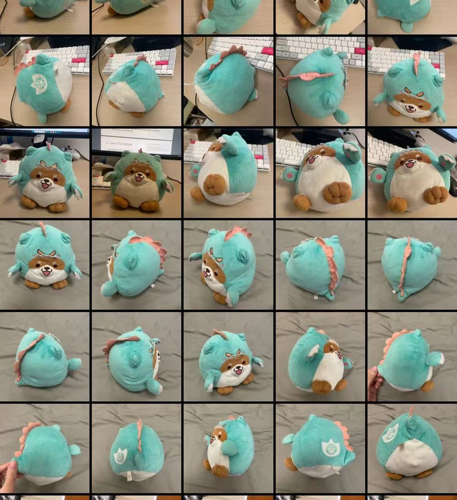
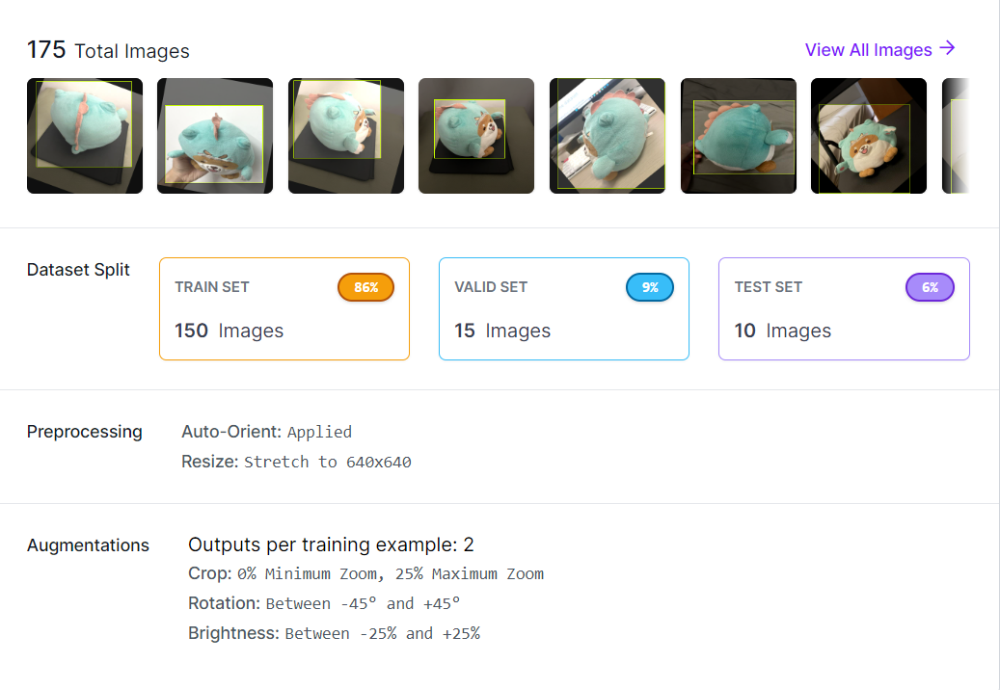
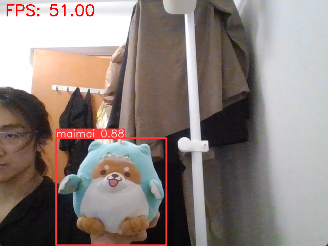

# ISDN6830B Homework2
### Song Chen 20761129
## Data Collection
I choose my toy dog "maimai" as the target object.  
  
## Label the Dataset
Label the dataset with augmentations (brightness, rotation, crop)  
Resize all pictures to 640*640  
  
## Model training
    if(args[0] == "train"):
        results = model.train(
            data='maimai.yaml', 
            epochs=100, 
            batch=1,
            imgsz=640, 
            save=True, 
            save_period=30,
            project="YOLOv8-ISDN6830-ObjectDetection"
        )
output weights as "best.pt"
## Validation
Load "best.pt"  
  
mAP  
  

## Prediction
  

## Limitations  
Bad performance in dark conditions.  
> Solution:  The performance improves as the ISO of camera increases.

Bad performance for far distance.  
> Solution:  I believe the issue may be due to the low resolution, resulting in smaller feature patches that are significantly smaller than YOLO's receptive field. To address this, we can utilize a Super Resolution Algorithm to enhance the patches with higher confidence. Another approach would be to combine models that have different receptive fields.
